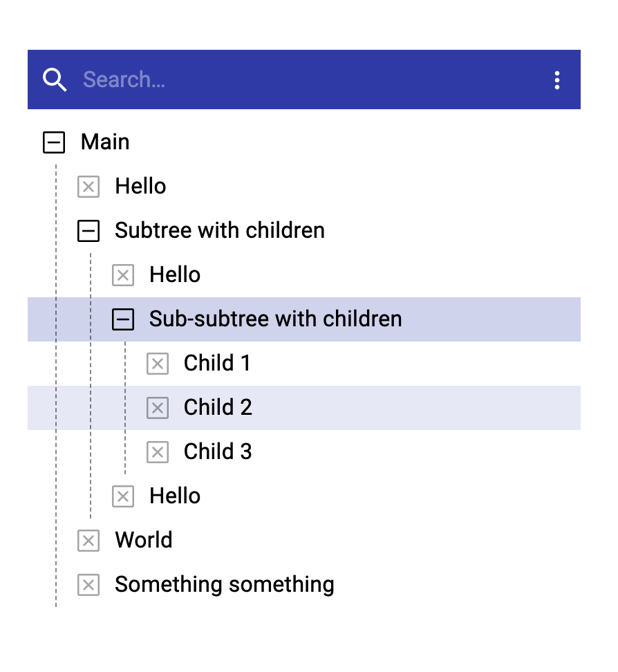

Copy from [Material-ui treeview example](https://material-ui.com/components/tree-view/), **imporve some features**:

- appearance：focus item's background color is through whole line;increase menu item line-height.
- add a toolbar with search function and setting menu button
- can keep focus style when clicking outside of tree (backgroundcolor of item)
- can only show items matched search keyword

